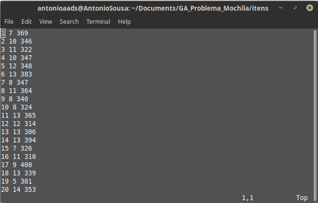
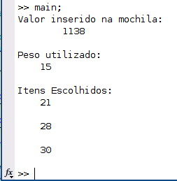

# Algorítmo Genético para o Problema da Mochila

Esse repositório possui um algorítmo genético implementado para solução do problema da mochila. Foi feito para introdução e melhor entendimento do algoritmo e de seu funcionamento. 

## O problema da mochila

O problema da mochila solucionado nesse repositório, trata-se do seguinte: Existem n itens, que possuem um peso e um valor específico, que devem ser inseridos em uma "mochila" que possui um peso máximo x.

O objetivo é escolher itens que resulte no maior valor agregado na mochila, sem ultrapassar o peso máximo suportado por ela.

## Implementação

### Inserção dos itens

Antes de rodar o algoritmo, necessita-se de ter um banco de dados que liste os itens que podem ser escolhidos para serem inseridos na mochila. Esses exemplos estão dentro da pasta itens. 

O padrão de como esses itens são listados é de extrema importância, e devem seguir o seguinte padrão: Três colunas separadas por espaço, sendo cada linha representada por um item, com a primeira coluna sendo a ordem do item, numero de 1 até o número máximo de itens, a segunda o peso do item, e a terceira o valor do item. 

Um modelo válido, com 20 itens, pode ser observado abaixo:

No início da main possui uma linha de load, que busca o itens para o workspace do MATLAB. Caso queira usar um exemplo próprio, basta colocar o nome do seu documento na linha do load, conforme abaixo:

    in = load ('itens/nome_do_seu_documento.txt');

## Execução

Para executar o código, basta alterar os parâmetros desejáveis, e rodar o main.

    %Alterar os dados abaixo

        %Load do documento com a listagem dos itens
        in = load ('itens/KNAPDATA40.txt');

        pop_size        =   20;     %Tamanho da população
        cross_rate      =   0.6;    %Taxa de crossover dos indivíduos
        mutation_rate   =   0.90;   %Probabilidade de não mutação de um gene
        belong_percent  =   85;     %Porcentagem de preenchimento dos genes do individuo aleatorio
        max_iterations  =   1000;   %Número máximo de iterações
        max_constraint  =   15;     %Tamanho máximo suportado pela mochila

    %Fim da parte de alteração de dados

Ao final da execução, temos o seguinte resultado: (Teste feito com os argumentos listados acima)

*Vale lembrar que o GA não necessariamente encontra a solução ótima, e as vezes pode nem encontrar uma próxima, sendo necessário reajustar os parâmetros para melhorar os resultados. Outro fato interessante é que ele nunca irá executar de maneira idêntica ao executar mais de uma vez, por exemplo, caso repitam o teste que demonstrei acima, podem encontrar um valor distindo, devido as funções randômicas utilizadas.*

